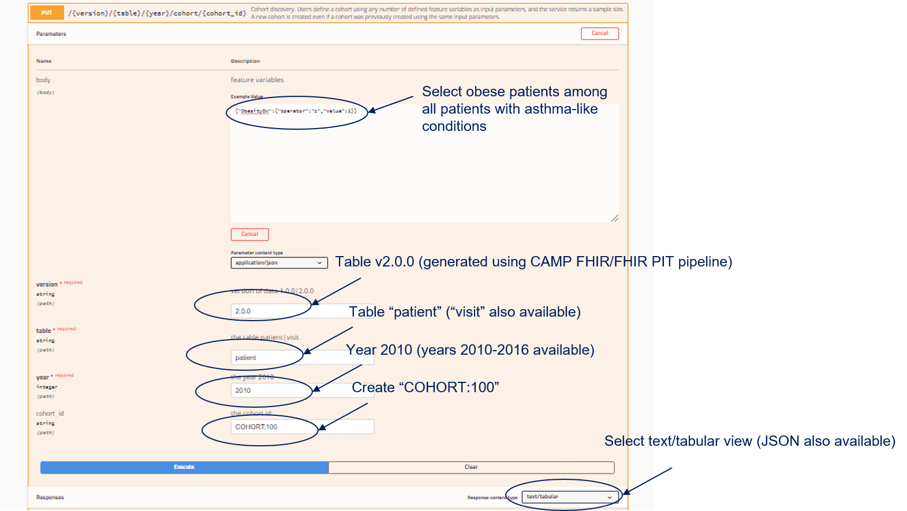
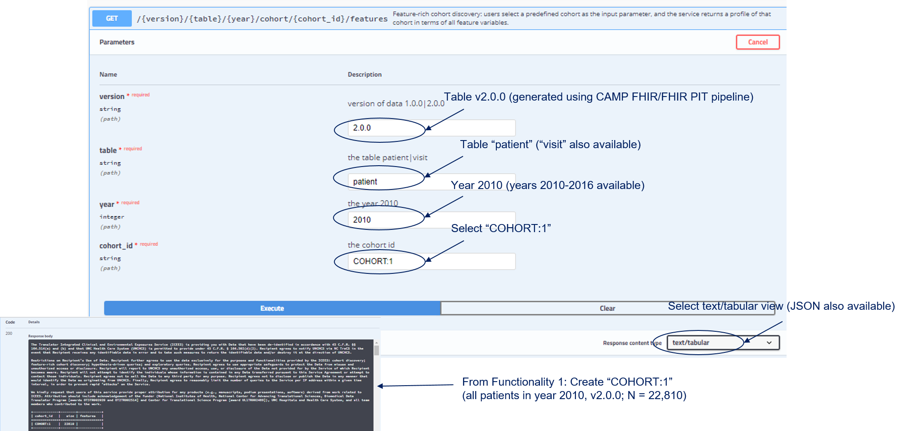
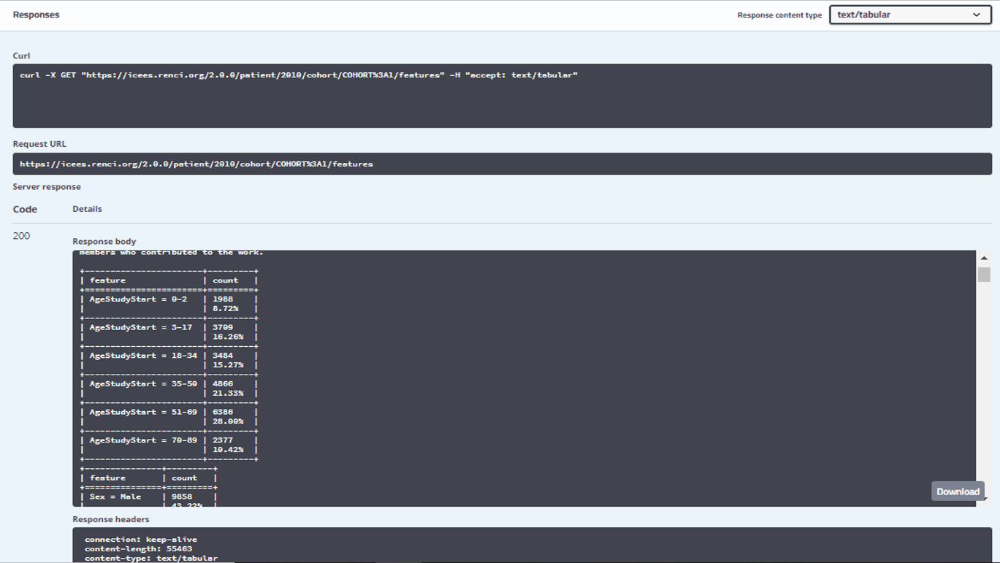
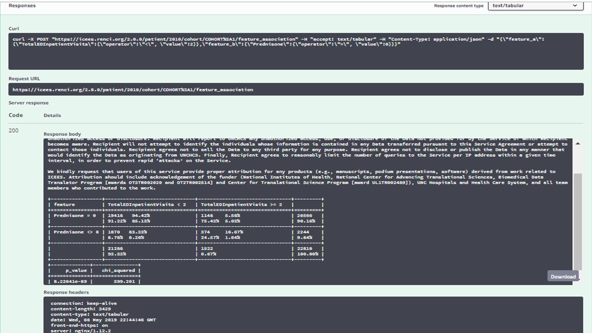
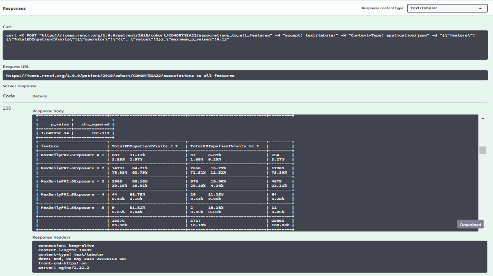

## ICEES

## Overview
Access to clinical data is critical for the advancement of translational research and the success of the Translator program. Yet, the many regulations that surround the use of clinical data, while critical to ensure and respect patient privacy, often hinder access to clinical data for research purposes. Moreover, the ability to share clinical data across institutions is central to open team science and the success of multi-institutional consortia such as The Biomedical Data Translator Consortium. One of the goals of the Translator program is to find novel ways to openly share computable data, including sensitive clinical data, and allow its integration in surprising ways (Ahalt et al., in press at CTS).

For example, [RENCI](https://renci.org/) and colleagues at the North Carolina Translational and Clinical Sciences Institute developed a novel approach for openly exposing clinical data on patients from UNC Health Care: the Integrated Clinical and Environmental Exposures Service (ICEES). ICEES provides open, regulatory-compliant access to clinical data that have been integrated with environmental exposures data (Fecho et al., in press at JAMIA). The exposures data are derived from public sources, including data on: airborne pollutants from the US EPA Community Multiscale Air Quality Modeling system; roadway exposures from the US DOT Highway Patrol Monitoring System; socio-environmental exposures from the US Census Bureau American Community Survey; and public school exposures from the National Center for Education Statistics. A custom, geospatial- and time-based, data-conversion and -integration pipeline has been developed to support the creation of ‘ICEES integrated feature tables’ (Pfaff et al., 2019; Pfaff et al., under review in JAMIA). The pipeline is modular and extensible and can be adapted for virtually any type of data that is of interest to researchers and requires geocodes, dates, and/or identifiers for integration.

Note that the exposures data are accessible independent of ICEES via open APIs: [US EPA CMAQ Airborne Exposures API](http://bdt-cmaq.renci.org:8080/cmaq_exposures_api/v1/ui/#!/default/get_values); [US DOT Roadway Exposures API](http://bdt-proximity.renci.org:8080/roadway_proximity_api/v1/ui/#!/default/get_distance); and [US Census Bureau ACS API](http://bdt-social.renci.org:8080/socio_environmental_exposures_api/v1/ui/#!/default/get_values). Each of these APIs/services contains documentation on their content and user access, including inputs and outputs. The data can be applied to numerous use cases. For example, the data have been used by investigators at NIEHS for integrations with survey data as part of their Environmental Polymorphisms Registry.

## User Manual

**ICEES Overview**

[ICEES](https://icees.renci.org/apidocs/) provides a regulatory-compliant, open framework and approach for sharing sensitive patient data, with minimal risk of data leakage and multiple embedded safeguards. ICEES exposes sufficiently granular clinical data to support reasoning and inference. It is compliant with HIPAA and UNC Chapel Hill policies and was approved by the Oversight Committee of the Carolina Data Warehouse for Health.

[**Sensitivity of Patient Data**](SensitivityScale.png)

**ICEES Integrated Feature Tables**

Integrated feature tables contain clinical data on patients from the UNC Health Care System and environmental exposures data from a variety of public sources. The clinical and exposures data are integrated at the patient and visit level. Patient- and visit-level tables are defined by ‘study’ periods (i.e., calendar years). Tables have been created for years 2010-2016 and currently contain data derived from ~160,000 patients with an asthma-like condition in the UNC Health Care System. Of note, however, is that ICEES is not restricted to patients with asthma-like conditions; indeed, new tables are being developed for a variety of patient cohorts (e.g., diabetes, drug-induced liver injury).

The integrated feature tables are created via a custom software application pipeline. CAMP FHIR (Clinical Asset Mapping Program for FHIR), to transform clinical data from common data models (e.g., i2b2, PCORnet, OMOP) into HL7 Fast Healthcare Interoperability Resource (FHIR) files. A subsequent custom software application, FHIR PIT (Patient data Integration Tool), then integrates the clinical data with environmental exposures data from multiple sources before stripping the data of PHI and binning feature variables to create ICEES tables. Of note, FHIR PIT is modular and extensible and can be adapted for virtually any type of data that is of interest to clinical researchers and requires geocodes, dates, and identifiers for integration with EHR data.

[**CAMP FHIR/FHIR PIT Conversion and Integration Pipeline**](CAMP_FHIR_FHIR_PIT.png)

With ICEES, regulatory issues were addressed primarily by binning or recoding the data and presenting the data to users in aggregate form only

[**Binning Approach**](BinningApproach.png)

[**Data Aggregation**](Aggregation.png)

ICEES is accessible via an OpenAPI.

**ICEES Four Main Functionalites**
1. Cohort discovery: users define a cohort using any number of defined feature variables as input parameters, and the service returns a sample size.
2. Feature-rich cohort discovery: users select a predefined cohort as the input parameter, and the service returns a profile of that cohort in terms of the available feature variables.
3. Hypothesis-driven 2 x 2 feature associations: users select a predefined cohort and two feature variables, and the service returns a 2 x 2 feature table with a corresponding Chi Square statistic and P value.
4. Exploratory 1 X N feature associations: users select a predefined cohort and a feature variable of interest, and the service returns a 1 x N feature table with corrected Chi Square statistics and associated P values.

*New functionalities continue to be added.

**ICEES API**

**Functionality 1: Cohort Discovery**

Shown below is the API output for the above request.

**Functionality 2: Feature-rich Cohort Discovery**

Shown below is the API output for the above request. In this case, the age distribution for COHORT:1 is provided. Note, however, that statistics are returned for all available feature variables

**Functionality 3: Hypothesis-driven 2 x 2 Feature Associations**

Shown below is the API output for the above request. This example shows that for patients with asthma-like conditions (N = 22,810 in year 2010), 17% of those who were prescribed/administered prednisone had >=2 annual ED or inpatient visits for respiratory issues vs 6% of those were not prescribed/administered prednisone (P < 0.0001).

Prednisone use is a common indicator of a patient with severe asthma.

*Fecho et al., accepted for submission as a Special Communication in Journal of Biomedical Informatics*

**Functionality 4: Exploratory 1 X N Feature Associations**

Shown below is the API output for the above request. This example shows that for patients with asthma-like conditions (N = 23,093 in year 2010, v1.0.0), the percentage of patients with >=2 ED or inpatient visits for respiratory issues increases with increasing levels of exposure to particulate matter <=2.5-microns in diameter (P < 0.0001). The non-linearity of the exposure-response curve imposed by Bin 5 reflects the fact that only 11 patients were binned into that exposure category. A new ICEES feature accounts for this issue by allowing users to collapse contiguous bins and/or choose from a variety of binning strategies via the selection of feature variables (see ICEES documentation).

*Fecho et al., accepted for publication in JAMIA*

