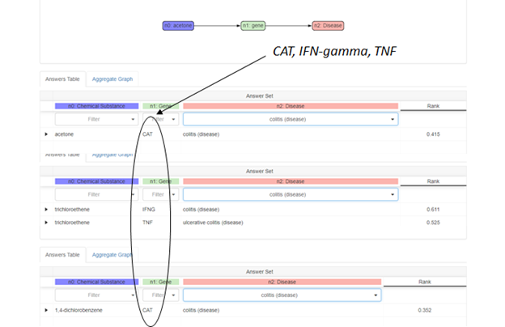

## Shared AOPs for Environmental Exposures

CS is a translational investigator on a long-term, longitudinal, large-scale effort designed to better define the genetic and environmental determinants of health and disease. The study involves nearly 20,000 participants and was initiated roughly 20 years ago. Participants provide DNA samples and survey data designed to collect information on health, family history of disease, environmental exposures, and lifestyle data. In a recent analysis of a subset of the data, investigators identified clusters of unexpected associations between subject-reported chemical exposures and immune-mediated diseases. In one cluster, the chemical exposures were three solvents&mdash;dichlorobenzene, acetone, and trichloroethylene&mdash;and the associated disease was ulcerative colitis. The investigators wanted to determine:

1. whether the association was spurious or supported by scientific evidence; and
2. what potential adverse outcome pathways (AOPs) might explain the association.

Translator team members used [ROBOKOP](/apps/robokop) to generate AOPs for each of the solvents, structured as follows:

solvent ⇨ gene ⇨ disease.

[ROBOKOP](/apps/robokop) identified three potential gene targets that might explain the adverse effects of the three solvents (CAT, IFN-gamma, TNF); one (CAT) is shared by both acetone-colitis and dichlorobenzene-colitis. A subsequent evaluation of [Chemotext](http://chemotext.mml.unc.edu/) and the PubMed citations supporting these relationships provided validity and suggested plausible biological pathways and processes that might explain the unexpected clinical findings. Study investigators now plan to validate the findings by conducting a more rigorous retrospective analysis of their study data, including a genetic analysis targeted at the genes identified by [ROBOKOP](/apps/robokop).

_**Translator-enabled insights into AOPs!**_

**References**

**Bizon C**, **Cox S**, **Balhoff J**, **Kebede Y**, **Wang P**, **Morton K**, **Fecho K**, **Tropsha A**. ROBOKOP KG AND KGB: Integrated Knowledge Graphs from Federated Sources. *JCIM*, under review.

**Morton K**, **Wang P**, **Bizon C**, **Cox S**, **Balhoff**, **Kebede Y**, **Fecho K**, **Tropsha A**. ROBOKOP: an abstraction layer and user interface for knowledge grpahs to support question answering. *Bioinformatics*, 2019. [doi:10.1093/bioinformatics/btz604](https://doi.org/10.1093/bioinformatics/btz604).
