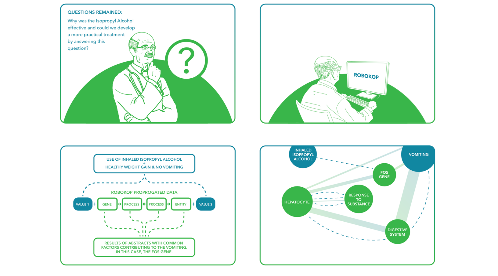

## COP for Isopropyl Alcohol and Cyclic Vomiting Disease

MM is part of a multidisciplinary team focused on rare diseases and comprised of practicing clinicians, translational scientists, computer scientists, and informaticians. The team was presented a challenging clinical use case involving a 19-year-old female, height 5'4" and weight 78 lbs, with a diagnosis of cyclic vomiting syndrome, a disease that she had been suffering from for years. Her doctors had tried many treatments over the years, but nothing seemed to stop or even reduce the episodes of emesis.

The team investigating the case happened to identify three publications that suggested an association between inhaled isopropyl alcohol and emesis. Out of desperation, and with the patient's consent to an experimental treatment with potential toxicity, the patient's doctors decided to initiate a trial.

Much to everyone's surprise, it worked! Five months after the trial was initiated, the patient reported zero episodes of emesis and an increase in weight to more than 100 lbs. The rare-disease team was thrilled but perplexed; after all, no one could provide an explanation of how inhaled isopropyl alcohol was effective in the treatment of cyclic vomiting syndrome. This was unfortunate because a better understanding of the chemical's MOA might yield insights into the etiology and pathophysiology of cyclic vomiting syndrome, as well as suggest treatments with improved safety and effectiveness.

Translator team members used [ROBOKOP](/apps/robokop) to generate a clinical outcome pathway (COP) and explore possible MOAs. An evaluation of the results led the Translator team to suggest to MM and his team that the clinical response is due to an interaction of isopropyl alcohol with the FOS gene-an explanation that logically made sense and had some literature support. The rare-disease team is now conducting a deep dive into the relationship between FOS, isopropyl alcohol, and emesis, in an effort to validate the relationship and identify potential drug targets.

> As Program Coordinator at PMI I work with patient cases and development or research plans and next steps for cases daily. A large portion of that work involves looking at specific gene targets and ways to compensate for a subsequent loss, lack of, or gain in specific gene or protein function and levels. We have a portion of cases that have been "stuck" for lack of better words where we have been unable to find recommendations or leads to chase for individuals. Since the addition of the ROBOKOP dataset, I along with other members of my team have had new query results that previous datasets could not generate, that have helped tremendously in the progress of these cases... As a result of the utility of the ROBOKOP data, our team is now going back through all of our current 283 cases and re-running them to see what new findings are returned.
>
> — Dr. JHB

_**Translator-enabled insights into COPs!**_

**References**

**Bizon C**, **Cox S**, **Balhoff J**, **Kebede Y**, **Wang P**, **Morton K**, **Fecho K**, **Tropsha A**. ROBOKOP KG AND KGB: Integrated Knowledge Graphs from Federated Sources. *JCIM*, under review.

**Morton K**, **Wang P**, **Bizon C**, **Cox S**, **Balhoff**, **Kebede Y**, **Fecho K**, **Tropsha A**. ROBOKOP: an abstraction layer and user interface for knowledge grpahs to support question answering. *Bioinformatics*, 2019. [doi:10.1093/bioinformatics/btz604](https://doi.org/10.1093/bioinformatics/btz604).
