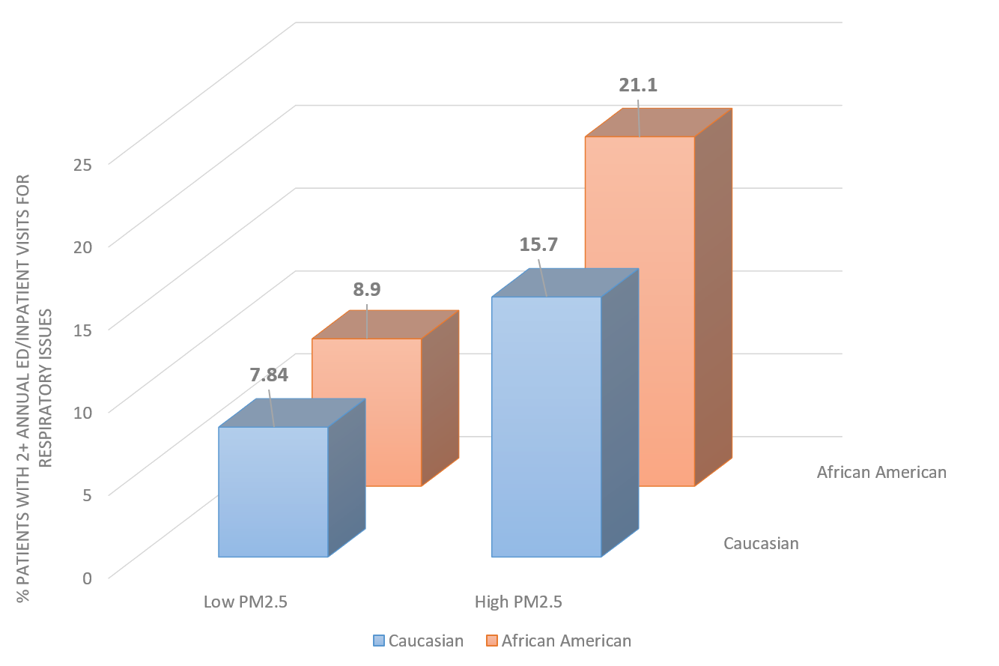

## Racial Disparities in Health Outcomes

JJ and SA are demographers who are interested in exploring racial and socio-economic disparities in health outcomes. Their focus is on cardiorespiratory conditions, which are prevalent throughout the southern ‘stroke belt’ and represent a major public health challenge. Indeed, in North Carolina, where they both have faculty appointments, stroke, asthma, and a variety of other cardiorespiratory issues are associated with significant healthcare costs, lost workplace productivity, and (for children) excessive school absences.

JJ and SA learn that [ICEES](/apps/icees) contains not only clinical data, but also demographic data and a variety of environmental exposures data, including socio-environmental exposures data derived from the US Census Bureau American Community Survey. To begin exploring the use of ICEES in the context of disparities in health outcomes, they submit several queries to ICEES that ask, in a general sense: what is the relationship between race, exposure to airborne particulate matter of size ≤ 2.5 µm in diameter (PM2.5), and respiratory complications among patients with ‘asthma-like’ conditions? 

The results showed that among African Americans with asthma-like conditions, the proportion of patients with two or more annual emergency department (ED) or inpatient visits for respiratory issues was higher among those exposed to relatively high average daily levels of PM2.5 than among those exposed to relatively low average daily levels of PM2.5 (21.10% versus 8.90%, P < 0.0001, N = 6,379). Caucasian patients with asthma-like conditions showed a similar relationship, with a greater proportion of patients with two or more annual ED or inpatient visits for respiratory issues among those exposed to relatively high average daily levels of PM2.5 than among those exposed to relatively low average daily levels of PM2.5 (15.70% versus 7.84%, P < 0.0001, N = 13,176).

These findings replicate published literature on the association between airborne pollutant exposure and asthma exacerbations (e.g., Mirabelli et al. 2016). Furthermore, they extend those findings to include a comparative race-based analysis.

Moreover, and of interest to JJ and SA, the results demonstrated an overall higher proportion of patients with two or more annual ED or inpatient visits for respiratory issues among African Americans with asthma-like conditions than among Caucasians with asthma-like conditions (20.47% vs 15.07%; P < 0.0001; N = 19,555), thus revealing a potential racial disparity in health outcomes.

A portion of this work has been published in *Clinical and Translational Science* (Ahalt et al. 2019). Complete findings, including those shown here and other ones, will be described in a manuscript that is under development and targeted for *Public Health Reports*.

**Translator-enabled open public health research!**

**References:**

Ahalt SC, Chute CG, Fecho K,* Glusman G, Hadlock J, Solbrig H, Overby-Taylor C, Pfaff E, Ta C, Tatonetti N, Weng C, and The NCATS Biomedical Data Translator Consortium. Clinical data: sources and types, regulatory constraints, applications. *Clin Transl Sci*, 2019 [E-pub ahead of print] doi: 10.1111/cts.12638. *Corresponding author. Authors are listed alphabetically. https://ascpt.onlinelibrary.wiley.com/doi/full/10.1111/cts.12638.

Mirabelli MC, Vaidyanathan A, Flanders WD, Qin X, Garbe P. Outdoor PM2.5, ambient air temperature, and asthma symptoms in the past 14 days among adults with active asthma. *Environ Health Perspect* 2016;124(12):1882–90.

